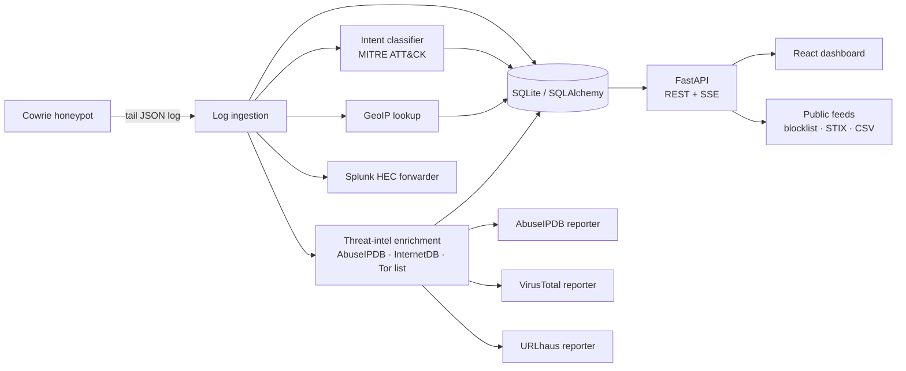

# Honeypot Tracker

[](https://github.com/jojohuang92/HoneypotTracker/actions/workflows/ci.yml)

**Real-time SSH honeypot attack-intelligence platform.** Deploys alongside a [Cowrie](https://github.com/cowrie/cowrie) honeypot, ingests attacker sessions as they happen, classifies their intent against MITRE ATT&CK, enriches them with geolocation and threat intelligence, and automatically reports malicious IPs and captured malware to public feeds — all surfaced through a live React dashboard.


---

## What it does

An SSH honeypot records everything an attacker types, but the raw logs are noise. Honeypot Tracker turns that stream into **attack intelligence**:

- **Ingests** Cowrie's JSON event log in real time and normalizes it into sessions, login attempts, commands, and captured files.
- **Classifies** each command into an intent (reconnaissance, malware deployment, cryptomining, credential theft, persistence, sabotage) and maps it to a **MITRE ATT&CK** technique.
- **Enriches** every source IP with GeoIP location, reputation data, and infrastructure context (open ports, CVEs, Tor/VPN/proxy tags), and captured payloads with local static analysis and VirusTotal.
- **Reports** confirmed attackers to AbuseIPDB, malware samples to VirusTotal, and payload URLs to abuse.ch URLhaus automatically, with deduplication and an audit trail.
- **Streams** new attacks to the browser over Server-Sent Events for a live view.

## Features

- 🗺️ **Live attack map** — attacker origins plotted and clustered via GeoIP (Leaflet).
- 🎯 **MITRE ATT&CK classification** — every command tagged with an intent and technique ID, shown as a coverage matrix.
- ⚡ **Real-time dashboard** — new sessions appear instantly over SSE; no polling.
- 🔎 **Attacker profiling & session replay** — reconstruct an attacker's full session keystroke-by-keystroke and profile behavior per IP.
- 🛡️ **Automated threat reporting** — background workers report to AbuseIPDB, submit malware to VirusTotal, and submit captured payload URLs to [URLhaus](https://urlhaus.abuse.ch/), with dedup windows and a `ReportLog` audit trail. URLs go out only while their capture is fresh, matching URLhaus's live-sites-only policy.
- 🧭 **Attacker infrastructure intel** — every source IP is looked up against Shodan InternetDB and the Tor Project exit list (both keyless): open ports, product CPEs, known CVEs on the attacker's own host, and tags like `tor` / `vpn` / `proxy` / `cloud` / `scanner`. Surfaced on the IP table, the attacker profile, and in every feed.
- 🔌 **SIEM integration** — forwards enriched events to Splunk via HTTP Event Collector.
- 📤 **Open IOC feeds** — attacker IPs, malware hashes, and URLs as a plaintext blocklist (`?exclude_tor=true` to drop exit nodes), a ranked `top-attackers.json`, CSV, or a STIX 2.1 bundle with deterministic ids (`/api/export/*`). Bodies are cached server-side and served with `Cache-Control` + `ETag`, so a fleet of pfSense/Pi-hole pollers costs one query per window and conditional requests get a 304.
- 🔎 **Analyst self-service** — filter attempts by country, event, intent, or protocol and download exactly that view as CSV (`/api/attempts/export.csv`, formula-safe for spreadsheets).
- 📖 **Methodology page** — `/methodology` documents what runs, the sensor footprint, how events become intelligence, data handling and retention, the open feeds, and the corpus's limitations.
- 🔔 **Push alerts** — [ntfy](https://ntfy.sh) / Discord notifications for high-signal events: successful logins, captured malware, VirusTotal detections, and first-seen countries, with per-key cooldowns to stop alert storms.
- 🧹 **Data retention** — optional pruning of raw events after N days, with per-day aggregates preserved forever so long-term trends survive on small hosts (e.g. a Raspberry Pi SD card).
- 💾 **Verified backups** — a daily systemd timer snapshots the database through SQLite's `VACUUM INTO` (consistent while the API keeps serving), packs it with `.env` and the captured samples into a checksummed zstd archive, and rotates the last 7. `scripts/restore.sh` restores one with digest and integrity verification; CI exercises both scripts end to end.
- 🔐 **Secured admin surface** — header-based admin auth (constant-time comparison) and per-route rate limiting.
- 🐳 **One-command deploy** — `docker compose up` builds and runs backend + dashboard behind nginx; CI runs the full test suite on every push.

## Architecture



**Backend** — Python 3.11, FastAPI, SQLAlchemy 2, SQLite. Log ingestion, the reporting workers, and the retention worker run as async background tasks in the app lifespan. Server-Sent Events push live updates.

**Frontend** — React 19 + TypeScript, Vite 7, TailwindCSS 4. Leaflet for the map, Recharts for charts, TanStack Table for data grids.

### Design decisions

A few choices worth calling out, because they were deliberate:

- **Rule-based classifier over a black-box model.** Intent classification is an ordered set of explicit regex rules (`services/classifier.py`) mapping commands → intent → ATT&CK technique. For a security tool, *explainability* — being able to point at the exact rule that fired — matters more than squeezing out marginal accuracy. (An experimental ML classifier lives in `ml/` as a future path.)
- **Non-blocking enrichment.** GeoIP, reputation lookups, and outbound reporting all run as background workers so a slow third-party API or a Splunk outage can never stall log ingestion.
- **Deduplicated, audited auto-reporting.** Each reporter checks a `ReportLog` table before acting (a time-window dedup for IPs, report-once for file hashes) and records every action — so the same attacker isn't reported twice and every outbound report is traceable.
- **Header-based admin auth.** The admin API and the authenticated SSE stream take the key via the `X-Admin-Key` header and compare it with `secrets.compare_digest`, keeping the secret out of URLs, proxy logs, and browser history.

## Quickstart

### Docker (recommended)

```bash
cp backend/.env.example backend/.env   # then edit — see Configuration below
docker compose up -d --build
```

The dashboard serves on `http://localhost:8080` with nginx proxying `/api` to the backend (SSE-aware, real client IPs preserved for rate limiting). The Cowrie log directory is mounted from `/var/log/cowrie` by default — override with `COWRIE_LOG_DIR=/path/to/logs docker compose up -d`. To enable the attack map, copy the GeoLite2 database into the data volume:

```bash
docker compose cp GeoLite2-City.mmdb backend:/app/data/
```

### Manual

**Prerequisites:** Python 3.11+, Node 20+, and (optionally) a running Cowrie honeypot producing a JSON log.

### Backend

```bash
cd backend
python -m venv venv
source venv/bin/activate
pip install -r requirements.txt

cp .env.example .env        # then edit .env — see Configuration below
uvicorn app.main:app --reload
```

The API serves on `http://localhost:8000`. Interactive OpenAPI docs are auto-generated at **`http://localhost:8000/docs`**, and a health probe lives at `/api/health`.

### Frontend

```bash
cd frontend
npm install
npm run dev
```

The dashboard serves on `http://localhost:5173`.

## Configuration

Configuration is read from `backend/.env` (see [`backend/.env.example`](backend/.env.example)):

| Variable            | Purpose                                                        | Required |
| ------------------- | ------------------------------------------------------------- | -------- |
| `ADMIN_API_KEY`     | Secures `/api/admin/*` and the authenticated SSE stream       | Strongly recommended in prod |
| `COWRIE_LOG_PATH`   | Path to the Cowrie JSON event log to ingest                   | Yes (for live data) |
| `GEOIP_DB_PATH`     | Path to the MaxMind GeoLite2-City `.mmdb` database            | For the attack map |
| `CORS_ORIGINS`      | Comma-separated allowed dashboard origins                     | For non-local deploys |
| `VIRUSTOTAL_API_KEY`| Enables malware submission/enrichment                         | Optional |
| `ABUSEIPDB_API_KEY` | Enables IP reputation lookups and auto-reporting              | Optional |
| `SPLUNK_HEC_URL` / `SPLUNK_HEC_TOKEN` | Forward enriched events to a Splunk HEC     | Optional |
| `URLHAUS_AUTH_KEY`  | Enables submitting captured payload URLs to abuse.ch URLhaus (`URLHAUS_ANONYMOUS`, `URLHAUS_MAX_AGE_HOURS` tune it) | Optional |
| `IP_INTEL_ENABLED`  | Keyless attacker-infrastructure lookups (Shodan InternetDB + Tor exit list); default on | Optional |
| `EXPORT_CACHE_SECONDS` | How long `/api/export/*` bodies are cached and advertised via `Cache-Control` (default 300) | Optional |
| `NTFY_URL` / `DISCORD_WEBHOOK_URL` | Push alerts for successful logins, malware, VT hits, new countries | Optional |
| `RETENTION_DAYS`    | Prune raw events older than N days (0 = keep forever)        | Optional |

> **Note:** if `ADMIN_API_KEY` is unset, admin endpoints and the authenticated stream run open (intended for local development). Always set it in production.

## Testing

The backend has a pytest suite covering routers, services, and the classifier:

```bash
cd backend
source venv/bin/activate
pytest
```

## Public feeds

The IOC feeds need no account. Each accepts `?days=N` (1–365, default 30), is rebuilt at
most every `EXPORT_CACHE_SECONDS`, and honours `If-None-Match`:

| Endpoint | Content | Typical consumer |
| -------- | ------- | ---------------- |
| `/api/export/blocklist.txt` | One IP per line, `#` header with provenance; `?exclude_tor=true` drops Tor exits | pfSense / OPNsense aliases, Pi-hole, fail2ban |
| `/api/export/top-attackers.json` | Sources ranked by attempts with intent, country, tags | scripts, dashboards |
| `/api/export/iocs.csv` | IPs, SHA-256 hashes, and URLs in one file; IP rows carry `tags=…` | SIEM lookups |
| `/api/export/stix.json` | STIX 2.1 bundle, deterministic indicator ids | MISP, OpenCTI |

```bash
curl -fsS https://honeypottracker.live/api/export/blocklist.txt?days=7 | grep -v '^#'
```

Only globally routable addresses are ever exported; private ranges are dropped at ingestion.

## Operations

### Backups

A `honeypot-backup.timer` unit runs `scripts/backup.sh` daily. Each run writes one
self-contained archive to `~/honeypot-data/backups/`:

```
honeypot-20260911T052212Z.tar.zst          # database + .env + captured samples
honeypot-20260911T052212Z.tar.zst.sha256
```

The database is copied with SQLite's `VACUUM INTO` rather than `cp`, because the
database runs in WAL mode — recently committed rows live in `honeypot.db-wal`, so
a file copy would silently produce a backup missing them. The copy is verified with
`PRAGMA integrity_check` before it is packed; a snapshot that fails verification is
discarded and the existing rotation is left untouched. Each archive carries a
`MANIFEST.json` with per-table row counts, the database digest, and the deployed git
SHA. The 7 newest are kept. On a Raspberry Pi 5, a 724 MB database takes ~43 s and
packs to ~153 MB.

Archives contain both secrets and live attacker malware: they are written `0600` in a
`0700` directory and are never extracted automatically.

Run one by hand at any time — the API keeps serving throughout:

```bash
scripts/backup.sh
```

### Restore

```bash
scripts/restore.sh latest
```

Verifies the archive against its sidecar, checks the extracted database against the
manifest digest and `integrity_check`, stops the API, moves the current database aside
as `honeypot.db.pre-restore-<timestamp>` (never deletes it), installs the snapshot,
restarts, and polls `/api/health`.

It restores the database alone by default — in a real recovery `.env` and the sample
directory are usually current and must not be rolled back underneath a running system.
Add `--with-env` / `--with-samples` to restore those too, and `--force` to overwrite a
database that has been modified since the snapshot was taken.

> **Note:** backups land on the same SD card as the data. That covers a bad migration,
> a corrupting bug, or an accidental delete — not the card failing. An off-device copy
> is the next step, and must encrypt before it transmits.

## Project structure

```
backend/
  app/
    routers/        # FastAPI route handlers (attempts, stats, geo, malware,
                    #   stream, admin, profile, search, replay, meta, ...)
    services/       # ingestion, classifier, geoip, ip_lookup, ip_intel, alerts,
                    #   abuse_reporter, vt_reporter, urlhaus_reporter, export_cache,
                    #   splunk_forwarder, retention
    models.py       # SQLAlchemy models
    schemas.py      # Pydantic schemas
    config.py       # settings + startup validation
  ml/               # experimental ML classifier (offline training)
  tests/            # pytest suite
frontend/
  src/
    components/     # Dashboard panels, charts, map
    hooks/          # useSSE, useAttempts
    utils/          # API client, formatters
scripts/
  deploy.sh         # production deploy, run by the self-hosted CI runner
  backup.sh         # daily verified snapshot (database + .env + samples)
  restore.sh        # restore a snapshot, with verification and a rollback copy
  notify-failure.sh # ntfy alert for a failed scheduled unit
  systemd/          # version-controlled units, installed by deploy.sh
```

## Roadmap

- [x] Containerized deployment (`docker-compose` for backend + frontend)
- [x] CI pipeline (pytest, ESLint, type-check on every push)
- [x] Push alerting (ntfy / Discord) for high-signal events
- [x] Data retention with daily aggregation
- [ ] Generalized "playbook runner" to unify the reporting workers
- [ ] Wire the experimental ML classifier in as an optional enrichment path
- [ ] Attacker-infrastructure analytics (shared payloads and credential lists across IPs/ASNs)

## License

Released under the [MIT License](LICENSE).
